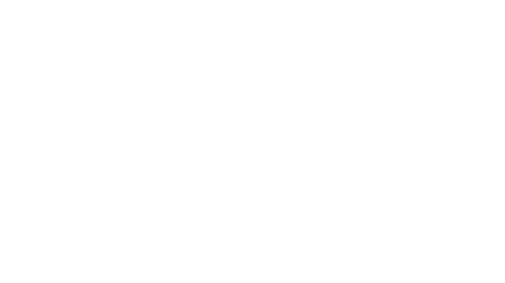

# Starfield Interface
This repository provides user interface source files for Starfield mod authors.
These source files are edited by Adobe Flash software to publish swf files used by the game.
Though the sources have been reconstructed in certain areas, the files here are intended to represent the vanilla interface as closely as possible, **including the vanilla bugs**!

Game Version `F06997E0 1.10.32.0`

# Fonts
The fonts used by Starfield.

| Class                          | Font                            |
|--------------------------------|---------------------------------|
| `$DebugTextFont`               | Consolas                        |
| `$ConsoleFont`                 | Arial                           |
| `$MAIN_Font`                   | NB Architekt Light              |
| `$MAIN_Font_Bold`              | NB Architekt                    |
| `$NB_Grotesk_Bold`             | NB Grotesk R Bold               |
| `$NB_Grotesk_Semibold`         | NB Grotesk R Semibold           |
| `$HandwrittenFont`             | Handwritten_Institute           |
| `$Controller_Buttons_thin`     | Genesis Controller Buttons thin |
| `$Controller_Buttons_inverted` | Genesis Controller  Buttons inv |
| `$Controller_Buttons`          | Genesis Controller  Buttons     |

### Localized Libraries
- `Fonts_en.swf`: English
- `Fonts_ja.swf`: Japanese
- `Fonts_zhcn.swf`: Simplified Chinese

# Eaze Tween AS3 Library
Eaze Tween is an motion tween library for AS3.
You can find the full source for the entire Eaze Tween library here.
http://code.google.com/p/eaze-tween/

# Shared
These are the shared code imports for Starfield.

## Shared.Components.ButtonControls
- uses: ButtonBar

# Components
The top level UI components used by Starfield.

## PlanetInfoCard
The planet info card.

# Assets
These are the author time shared library (ASL) assets
Author time shared libraries (ASL) are baked into each swf that uses them.

## LevelUpIcons
The level up icons are used by these menus and components.
- DataMenu
- DataMenuSharedComponents
- InventoryMenu
- LoadingMenu
- StatusMenu

## MetersShared
- RSL Import: `fonts_en.swf`

# Menus
The UI menus used by Starfield.

## Console
Uses only the `$ConsoleFont` for all text fields.

#### Imports:
- `Bethesda.Fonts_en`
- `Bethesda`

#### BGSCodeObj
- `executeCommand(command:String) : *`
- `loadPreviousCommands(array:Array) : *`
- `savePreviousCommands(array:Array) : *`
- `loadHistory() : *`
- `saveHistory(history:String) : *`
- `onHideComplete() : *`

## LoadingMenu
Although all the text fields use the `$NB_Grotesk_Semibold` font, all of the `fonts_en.swf` font symbols are imported.
This menu uses the `LevelUpIcons` asset.

#### Imports:
- `Bethesda.Fonts_en`
- `Bethesda`

# DataMenu
The SWF file uses assets from an imported SWF file.
- RSL Import: `fonts_en.swf`
- RSL Import: `ButtonClips.swf`
- RSL Import: `Factions.swf`
- RSL Import: `MetersShared.swf`

## GalaxyStarmapMenu
- Components: `Icons`
- Components: `PlanetInfoCard`
- Components: `StarMapWidgets`

## GalaxyStarmapMarkers
- Components: `Icons`

## SystemView
- Components: `StarMapWidgets`

## SystemInfoPanel
- Components: `StarMapWidgets`

## SurfaceMap
- Components: `Icons`
- Components: `PlanetInfoCard`

## HUDMenu
- Components: `Icons`

## TestMenu
- Components: `ComponentResourceIcon`
- Components: `ImageFixture`
